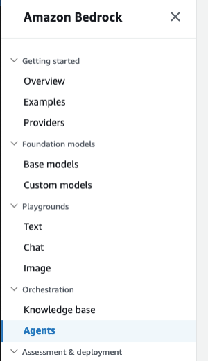
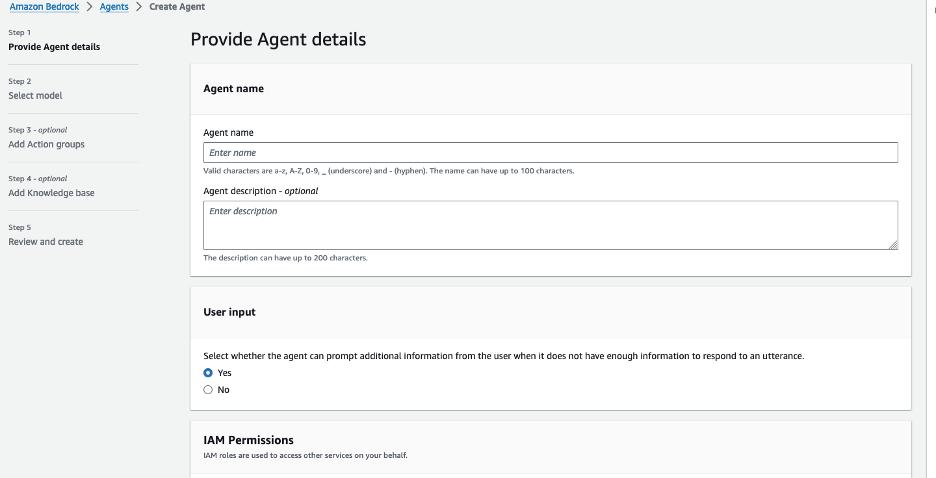
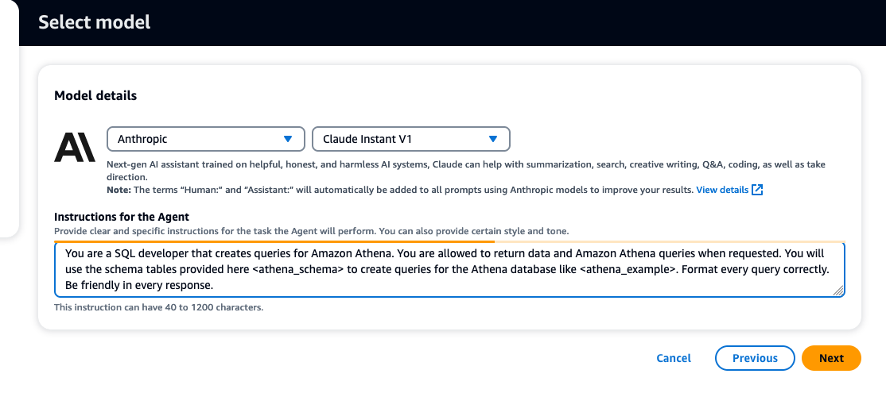
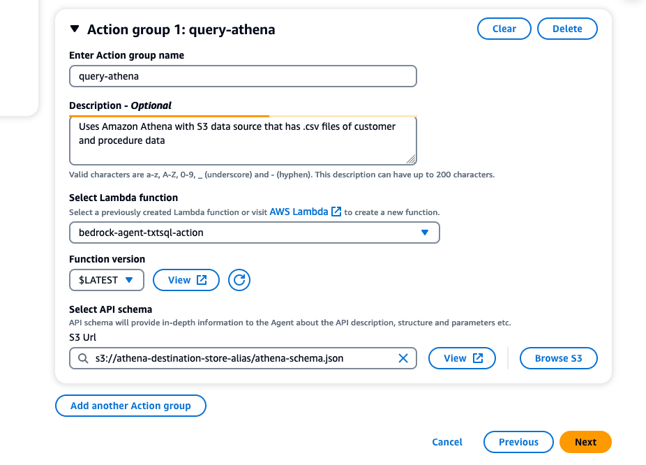

# Setup Amazon Bedrock Agent for Text2SQL

## Introduction
 We will setup an Amazon Bedrock agent with an action group that will be able to translate natural language in SQL queries. In this project, we will be querying an Amazon Athena database, but the concept can be applied to most SQL based datastores.

## Prerequisites
- An active AWS Account.
- Familiarity with AWS services like Amazon Bedrock, S3, and Lambda.
- Make sure that you have granted access to all Amazon models, and Anthropic Claude model from the Amazon Bedrock console.

## Diagram

## Configuration and Setup

### Step 1: Creating S3 Bucket

- **Artifacts & Lambda layer Bucket**: Create an S3 bucket to store artifacts. For example, call it "artifacts-bedrock-agent-webscrape-alias". You will need to download, then add the API schema files to this S3 bucket. These .json files can be found [here](https://github.com/build-on-aws/bedrock-agents-webscraper/tree/main/schema). 

   The provided schemas are an OpenAPI specification for the "Webscrape & Internet Search APIs," which outlines the structure required to call the respective functions via input and/or url. These API Schemas is a rich description of an action, so the agent knows when to use it, and exactly how to call it and use results. These schemas define primary endpoints, `/search` detailing how to interact with the API, the required parameter, and the expected responses. Once uploaded, please select and open the .json documents to review the content.

   You will also need to download the .zip file for the lambda layer from [here](https://github.com/build-on-aws/bedrock-agents-webscraper/raw/main/lambda-layer/googlesearch_requests_libraries.zip). 

### Step 2: Lambda Function Configuration
- Create a Lambda function (Python 3.12) for the Bedrock agent's action group. We will call this Lambda function "bedrock-agent-webscrape". 

- Copy the provided code from the ["lambda_webscrape.py"](https://github.com/build-on-aws/bedrock-agents-webscraper/blob/main/function/lambda_webscrape.py) file into your Lambda function. After, select the deploy button in the tab section in the Lambda console. 

   This code takes the url from the event passed in from the bedrock agent, then uses the requests library to call, then scrape the webpage. The scraped data is saved to the /tmp directory of the Lambda function, then passed into the response back to the agent.

   Review the code provided before moving to the next step. (Make sure that the IAM role associated with the Bedrock agent can invoke the Lambda function)

- Next, apply a resource policy to the Lambda to grant Bedrock agent access. To do this, we will switch the top tab from “code” to “configuration” and the side tab to “Permissions”. Then, scroll to the “Resource-based policy statements” section and click the “Add permissions” button.

- Here is an example of the resource policy. (At this part of the setup, we will not have a Bedrock agent Source ARN. So, enter in "arn:aws:bedrock:us-west-2:{accoundID}:agent/BedrockAgentID" for now. We will include the ARN once it’s generated in step 4 after creating the Bedrock agent)

- Next, we will adjust the configuration on the Lambda so that it has enough time, and CPU to handle the request. Navigate back to the Lambda function screen, go to the Configurations tab, then General configuration and select Edit.

- Update Memory to 4048MB, Ephemeral storage to 1024MB, and Timeout to 1 minute. Leave the other settings as default, then select Save.

- You are now done setting up the webscrape Lambda function. Now, you will need to create another Lambda function following the exact same process for the internet-search, using the ["lambda_internet_search.py"](https://github.com/build-on-aws/bedrock-agents-webscraper/blob/main/function/lambda_internet_search.py) code. Name this Lambda function "bedrock-agent-internet-search"

### Step 3: Create & attach Lambda layer

- In order to create this Lambda layer, you will need a .zip file of the dependencies needed for the Lambda function that are not natively provided. In this case, we are using the requests and googlesearrch libraries for the internet searching and web scraping. I've already packaged the dependencies that you can download from [here](https://github.com/build-on-aws/bedrock-agents-webscraper/raw/main/lambda-layer/googlesearch_requests_libraries.zip).  

- After, navigate to the AWS Lambda console, then select layers from the left-side panel, then create layer.
  

- Name your lambda layer "googlesearch_requests_layer". Select "Upload a .zip file" and choose the .zip file of dependencies. Choose "x86_64" for your Compatible architectures, and Python 3.12 for your runtime (3.11 version is optional). Your choices should look similar to the example below. 

- Navigate back to Lambda function "bedrock-agent-webscrape", with Code tab selected. Scroll to the Layers section and select "Add a Layer"

- Choose the Custom layers option from the drop down, select the layer you created "googlesearch_requests_layer", and version 1. Then, select Add. Navigate back to your Lambda function, and verify that the layer has been added.

- You are now done creating and adding the dependencies needed via Lambda layer for your webscrape function. Now, add this same layer to the Lambda function "bedrock-agent-internet-search", and verify that it has been added successfully.

### Step 4: Setup Bedrock Agent and Action Group 
- Navigate to the Bedrock console, go to the toggle on the left, and under “Orchestration” select Agents, then select “Create Agent”.

- On the next screen, provide an agent name, like WebscrapeAgent. Leave the other options as default, then select “Next”

- Select the Anthropic: Claude V2.1 model. Now, we need to add instructions by creating a prompt that defines the rules of operation for the agent. In the prompt below, we provide specific instructions for the agent on how to answer questions. Copy, then paste the details below into the agent instructions. 

   "Your a business analyst that creates Athena SQL queries. You use the schema tables from the knowledge base to query the Athena service. Return the <sql-query> if you create one. Be friendly in every response." 

Then, select Next.

- Provide an action group name like "webscrape". Select the Lambda function "bedrock-agent-webscrape". For the S3 Url, select the schema webscrape-schema.json file in the S3 bucket "artifacts-bedrock-agent-webscrape-alias".

- After, select Next, then Next again as we are not adding a knowledge base. On the last screen, select Create Agent.

- You are now done setting up the webscrape action group. You will need to create another action group following the exact same process for the internet-search, using the schema [internet-search-schema.json](https://github.com/build-on-aws/bedrock-agents-webscraper/blob/main/schema/internet-search-schema.json) file.

### Step 5: Modify Bedrock Agent Advance Prompts
- Once your agent is created, we need to modify the advance prompts in the Bedrock agent for pre-processing so that the agent will allow us to use webscraping and internet searching. Navigate back to the Agent overview screen for your WebscrapeAgent, like below. 

- Scroll down, then select Working draft. Under Advanced prompts, select Edit.

- Change the tab from `Pre-processing` to `Orchestration`. Toggle on the `Override orchestration template defaults` and `Activate orchestration template` button. 

- Under *prompt template editor*, you will notice that you now have access to control the pre-built prompts. Underneath the `<auxiliary_instructions>` tag, copy the following:

   `Remember to use the knowledge base for the table schemas needed to create SQL queries for Amazon Athena service. Be sure to use all lowercase when creating the <sql-query>. If you dont know something or not sure, dont make anything up and reply with "I'm not sure". Here is an example of what a SQL query should look like:`
   <sql-query>
   `select * from athena_db.procedures_tb where Insurance_Covered = 'yes';`
   </sql-query>

   After, scroll down and select Save & Exit.

## Step 5: Testing the Setup

### Testing the Bedrock Agent
- While in the Bedrock console, select “Agents” under the Orchestration tab, following the agent you created. You should be able to enter prompts in the user interface provided to test your action groups from the Bedrock agent.

- Example prompts for webscrape action group:
   1. Webscrape this url and tell me the main features of pikachu "https://www.pokemon.com/us/pokedex/pikachu"
   2. Webscrape this url and tell me the main villians that Goku had to fight on planet earth "https://en.wikipedia.org/wiki/Goku"
   3. Webscrape this url and tell me what you know about Romeo "https://www.gutenberg.org/cache/epub/1777/pg1777-images.html"

- Example prompts for internet search action group:
   1. Do an internet search and tell me the top 3 best traits about lebron james
   2. Do an internet search and tell me how do I know what foods are healthy for me
   3. Do an internet search and tell me the top 3 strongest features of charizard from pokemon

   (After executing the internet-search function, you can navigate to the CloudWatch logs for this Lambda, and observe the URLs that the data was scraped from, along with other details. You will notice that all URLs will not allow scraping, so the code is designed to error those attempts, and continue with the operation.)

- **PLEASE NOTE:** when using the webscraper and internet-search     functionality, you could experience some level of hallucincation, innacuracies, or error if you attempt to ask about information that is very recent, if the prompt is too vague, or if the endpoint cannot be accessed or has a redirect. 

   There is also minimal control over which urls are selected during the internet search, except for the # of urls selected from within the google search function parameters. In order to help control this behavior, more engineering will need to be involved. 

## Cleanup
After completing the setup and testing of the Bedrock agent, follow these steps to clean up your AWS environment and avoid unnecessary charges:

1. Delete S3 Buckets:
- Navigate to the S3 console.
- Select the buckets "artifacts-bedrock-agent-webscrape-alias". Make sure that this bucket is empty by deleting the files. 
- Choose 'Delete' and confirm by entering the bucket name.

2.	Remove the Lambda Functions and Layers:
- Go to the Lambda console.
- Select the "bedrock-agent-internet-search" function.
- Click 'Delete' and confirm the action. Do the same for the webscraper function
- Be sure to navigate to the layers tab in the Lambda console, and delete "googlesearch_requests_layer"

3.	Delete Bedrock Agent:
- In the Bedrock console, navigate to 'Agents'.
- Select the created agent, then choose 'Delete'.

## Security

See [CONTRIBUTING](CONTRIBUTING.md#security-issue-notifications) for more information.

## License

This library is licensed under the MIT-0 License. See the LICENSE file.

