# Setup Amazon Bedrock Agent for Text2SQL Using Amazon Athena with Streamlit

## Introduction
We will setup an Amazon Bedrock agent with an action group that will be able to translate natural language to SQL queries. In this project, we will be querying an Amazon Athena database, but the concept can be applied to most SQL datastores.

## Prerequisites
- An active AWS Account.
- Familiarity with AWS services like Amazon Bedrock, Amazon S3, AWS Lambda, Amazon Athena, and Amazon Cloud9.
- Grant access to all Amazon models if not already be default, and Anthropic Claude models from the Amazon Bedrock console.


## Diagram

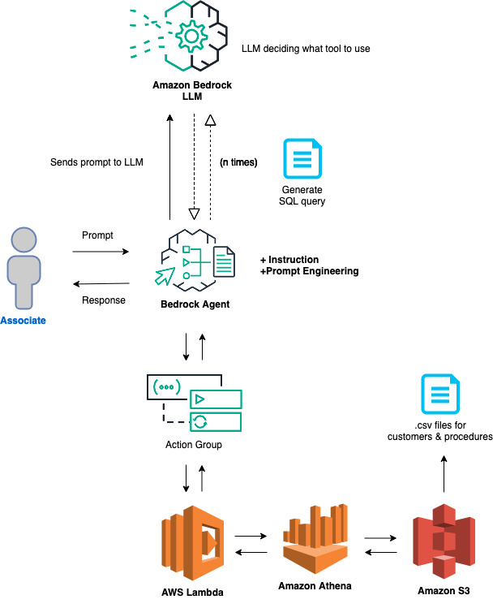

## Configuration and Setup

### Step 1: Grant Model Access

- We will need to grant access to the models that will be needed for our Bedrock agent. Navigate to the Amazon Bedrock console, then on the left of the screen, scroll down and select **Model access**. On the right, select the orange **Manage model access** button.

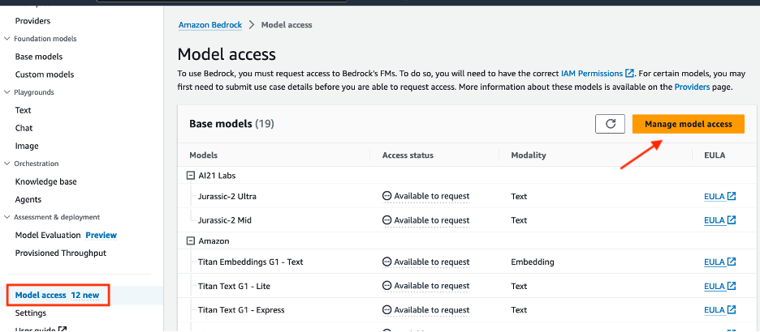

- Select the checkbox next to the base models for the **Anthropic** column. Also, verify that **Titan Embeddings G1 - Text** column is checked, if not by default. This will provide you access only to the required models. After, scroll down to the bottom right and select **Request model access**.


- After, verify that the Access status of the Models are green with **Access granted**.

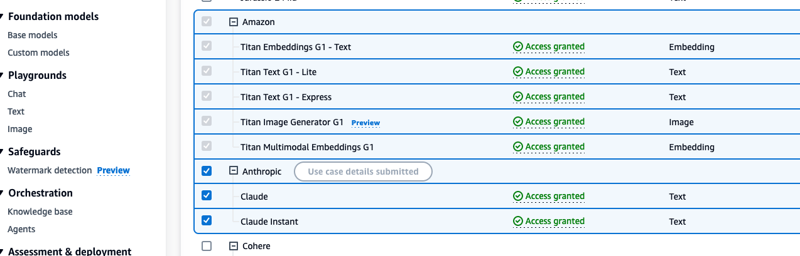


### Step 2: Creating S3 Buckets
- Make sure that you are in the **us-west-2** region. If another region is required, you will need to update the region in the `InvokeAgent.py` file on line 22 of the code. 
- **Domain Data Bucket**: Create an S3 bucket to store the domain data. For example, call the S3 bucket `athena-datasource-{alias}`. We will use the default settings. 
(Make sure to update **{alias}** with the appropriate value throughout the README instructions.)


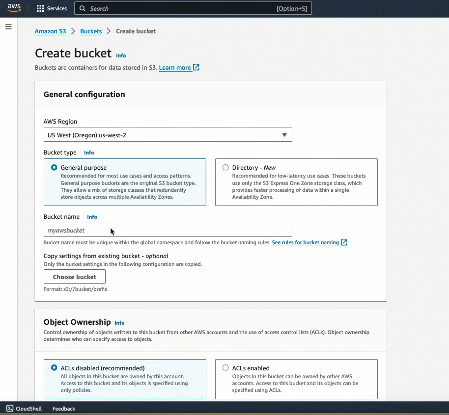


- After creation, download the .csv files located [here](https://github.com/build-on-aws/bedrock-agent-txt2sql/tree/main/s3data) by using the following `curl` command within a cmd(command prompt):

```python
curl https://raw.githubusercontent.com/build-on-aws/bedrock-agent-txt2sql/main/s3data/mock-data-customers.csv --output ~/Downloads/mock-data-customers.csv

curl https://raw.githubusercontent.com/build-on-aws/bedrock-agent-txt2sql/main/s3data/mock-data-procedures.csv --output ~/Downloads/mock-data-procedures.csv
```

- These files contain mock data of customer and procedure information. We will use these files that were downloaded in the **Downloads** folder as the datasource for our Amazon Athena service. Upload these files to S3 bucket `athena-datasource-{alias}`. Once the documents are uploaded, please review them.

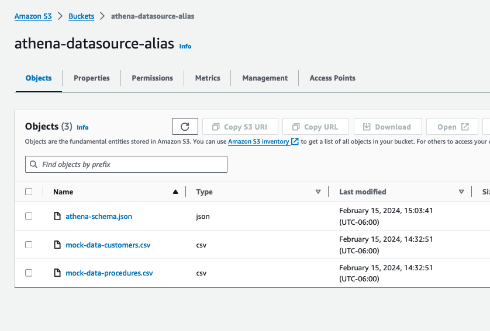


- **Amazon Athena Bucket**: Create another S3 bucket for the Athena service. Call it `athena-destination-store-{alias}`. You will need to use this S3 bucket when configuring the Amazon Athena service in the next step. 

- Also, we will add the API schema for the Lambda function to this S3 bucket. Download the schema file from [here](https://github.com/build-on-aws/bedrock-agent-txt2sql/blob/main/schema/athena-schema.json) by using the following `curl` command within a cmd(command prompt):

```bash
curl https://raw.githubusercontent.com/build-on-aws/bedrock-agent-txt2sql/main/schema/athena-schema.json --output ~/Downloads/athena-schema.json
```

- Then, upload this file to S3 bucket `athena-destination-store-{alias}`. We will use this S3 bucket to store the schema to help reserve on resources. 


### Step 3: Setup  Amazon Athena

- Search for the Amazon Athena service, then navigate to the Athena management console. Validate that the **Query your data with Trino SQL** radio button is selected, then press **Launch query editor**.


- Before you run your first query in Athena, you need to set up a query result location with Amazon S3. Select the Settings tab, then the manage button in the **Query result location and ecryption** section. 


- Add the S3 prefix below for the query results location, then select the Save button:

`s3://athena-destination-store-{alias}`


- Next, we will create an Athena database. Select the Editor tab, then copy/paste the following query in the empty query screen. After, select Run:

`CREATE DATABASE IF NOT EXISTS athena_db;`


- You should now see query successful at the bottom. On the left side under **Data**, change the default database to your database `athena_db` as shown in the screenshot above.

- Now, let's create the `customers` table. Run the following query in Athena. `(Remember to update the {alias} field)`:

```sql
CREATE EXTERNAL TABLE athena_db.customers (
  `Cust_Id` integer,
  `Customer` string,
  `Balance` integer,
  `Past_Due` integer,
  `Vip` string
)
ROW FORMAT DELIMITED 
FIELDS TERMINATED BY ',' 
LINES TERMINATED BY '\n'
STORED AS TEXTFILE
LOCATION 's3://athena-datasource-{alias}/';
```


Open another query tab and create the `procedures` table by running this query. `(Remember to update the {alias} field)`:

```sql
CREATE EXTERNAL TABLE athena_db.procedures (
  `Procedure_Id` string,
  `Procedure` string,
  `Category` string,
  `Price` integer,
  `Duration` integer,
  `Insurance_Covered` string,
  `Customer_Id` integer
)
ROW FORMAT DELIMITED 
FIELDS TERMINATED BY ',' 
LINES TERMINATED BY '\n'
STORED AS TEXTFILE
LOCATION 's3://athena-datasource-{alias}/';
```


Your tables for Athena within editor should look similar to the following:

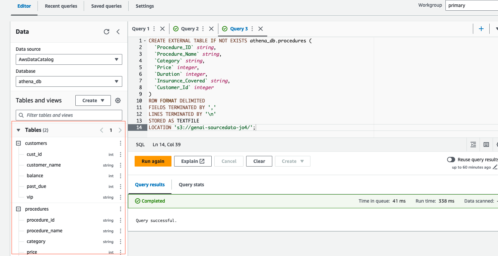

- Now, lets quickly test the queries against the customers and procedures table by running the following two example queries below:

`SELECT *
FROM athena_db.procedures
WHERE insurance_covered = 'yes' OR insurance_covered = 'no';`

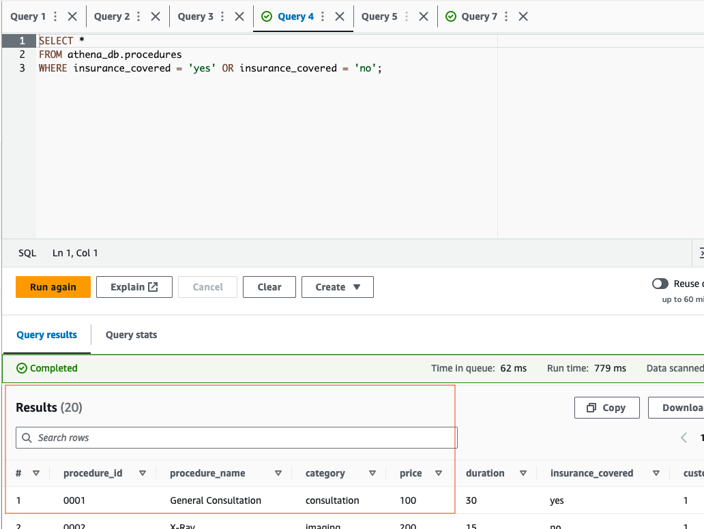


`SELECT * 
FROM athena_db.customers
WHERE balance >= 0;`


- If tests were succesful, we can move to the next step.


### Step 4: Lambda Function Configuration
- Create a Lambda function (Python 3.12) for the Bedrock agent's action group. We will call this Lambda function `bedrock-agent-txtsql-action`. 


- Copy the provided code from [here](https://github.com/build-on-aws/bedrock-agent-txt2sql/blob/main/function/lambda_function.py), or from below into the Lambda function.
  
```python
import boto3
from time import sleep

# Initialize the Athena client
athena_client = boto3.client('athena')

def lambda_handler(event, context):
    print(event)

    def athena_query_handler(event):
        # Fetch parameters for the new fields

        # Extracting the SQL query
        query = event['requestBody']['content']['application/json']['properties'][0]['value']

        print("the received QUERY:",  query)
        
        s3_output = 's3://athena-destination-store-alias'  # Replace with your S3 bucket

        # Execute the query and wait for completion
        execution_id = execute_athena_query(query, s3_output)
        result = get_query_results(execution_id)

        return result

    def execute_athena_query(query, s3_output):
        response = athena_client.start_query_execution(
            QueryString=query,
            ResultConfiguration={'OutputLocation': s3_output}
        )
        return response['QueryExecutionId']

    def check_query_status(execution_id):
        response = athena_client.get_query_execution(QueryExecutionId=execution_id)
        return response['QueryExecution']['Status']['State']

    def get_query_results(execution_id):
        while True:
            status = check_query_status(execution_id)
            if status in ['SUCCEEDED', 'FAILED', 'CANCELLED']:
                break
            sleep(1)  # Polling interval

        if status == 'SUCCEEDED':
            return athena_client.get_query_results(QueryExecutionId=execution_id)
        else:
            raise Exception(f"Query failed with status '{status}'")

    action_group = event.get('actionGroup')
    api_path = event.get('apiPath')

    print("api_path: ", api_path)

    result = ''
    response_code = 200


    if api_path == '/athenaQuery':
        result = athena_query_handler(event)
    else:
        response_code = 404
        result = {"error": f"Unrecognized api path: {action_group}::{api_path}"}

    response_body = {
        'application/json': {
            'body': result
        }
    }

    action_response = {
        'actionGroup': action_group,
        'apiPath': api_path,
        'httpMethod': event.get('httpMethod'),
        'httpStatusCode': response_code,
        'responseBody': response_body
    }

    api_response = {'messageVersion': '1.0', 'response': action_response}
    return api_response
```

- Then, update the **alias** value for the `s3_output` variable in the python code above. After, select **Deploy** under **Code source** in the Lambda console. Review the code provided before moving to the next step.


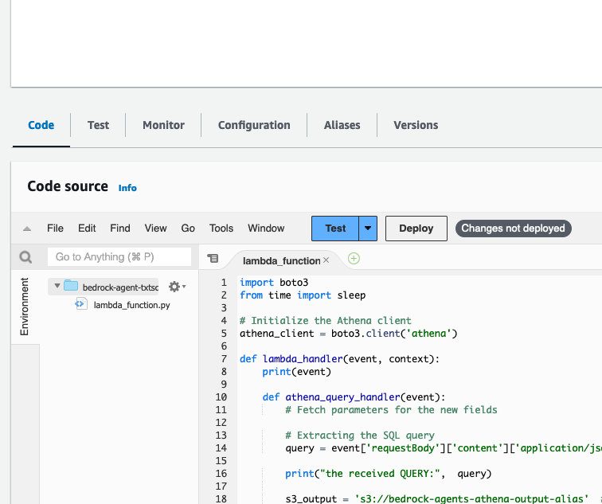

- Now, we need to apply a resource policy to Lambda that grants Bedrock agent access. To do this, we will switch the top tab from **code** to **configuration** and the side tab to **Permissions**. Then, scroll to the **Resource-based policy statements** section and click the **Add permissions** button.

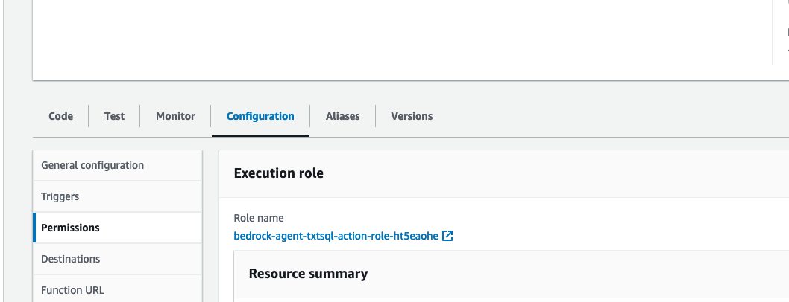


- Here is an example of the resource policy. (At this part of the setup, we will not have a Bedrock agent Source ARN. So, enter in `arn:aws:bedrock:us-west-2:{accoundID}:agent/BedrockAgentID` for now. We will include the ARN once it’s generated in step 6 after creating the Bedrock agent alias):


- We also need to provide this Lambda function permissions to interact with an S3 bucket, and Amazon Athena service. While on the `Configuration` tab -> `Permissions` section, select the Role name:


- Select `Add permissions -> Attach policies`. Then, attach the AWS managed policies `AmazonAthenaFullAccess` and `AmazonS3FullAccess` by selecting, then adding the permissions. Please note, in a real world environment, it's recommended that you practice least privilage.


- The last thing we need to do with the Lambda is update the configurations. Navigate to the `Configuration` tab, then `General Configuration` section on the left. From here select Edit.


- Update the memory to 1024 MB, and Timeout to 1 minute. Scroll to the bottom, and save the changes.

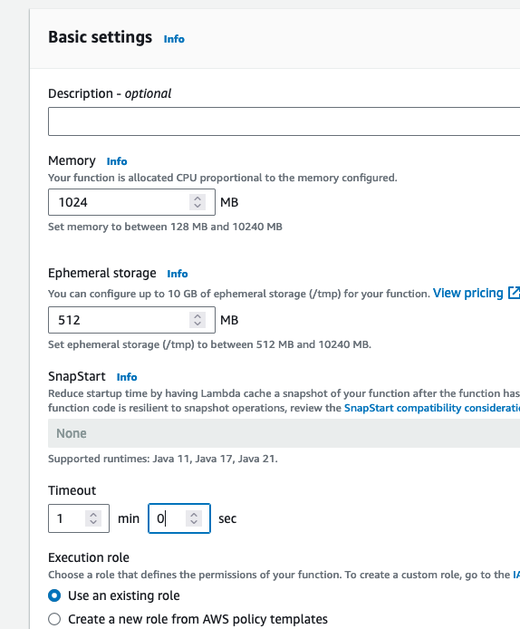


- We are now done setting up the Lambda function


### Step 5: Setup Bedrock Agent and Action Group 
- Navigate to the Bedrock console, go to the toggle on the left, and under **Orchestration** select **Agents**, then select **Create Agent**.


- On the next screen, provide an agent name, like “SQL-Agent”. Leave the other options as default, then select **Next**


- Select the **Anthropic: Claude Instant V1 model**. Next, we add instructions by creating a prompt that defines the rules of operation for the agent such as querying Athena and providing data. In the prompt below, we give specific direction on how the model should answer questions. Copy, then paste the details below into the agent instructions. 

```text
You are a SQL developer that creates queries for Amazon Athena. You are allowed to return data and Amazon Athena queries when requested. You will use the schema tables provided here <athena_schema> to create queries for the Athena database like <athena_example>. Format every query correctly. Be friendly in every response.
```


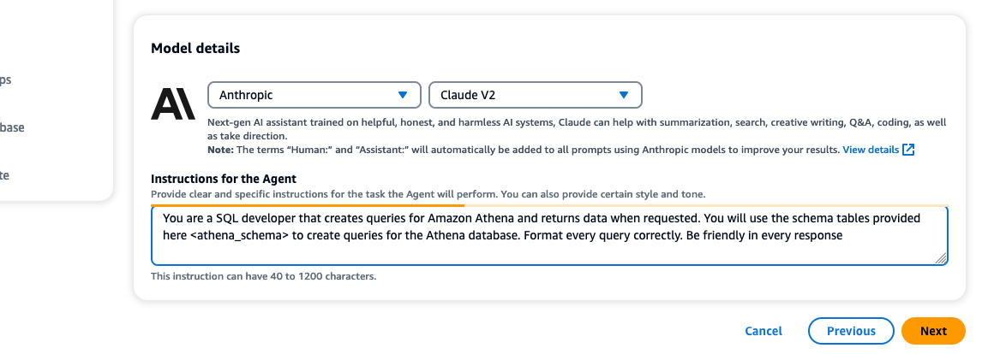

- When creating the action group, call it `query-athena`. Select Lambda function `bedrock-agent-txtsql-action`. Then, select the API schema `athena-schema.json` from S3 bucket `athena-destination-store-{alias}`. 

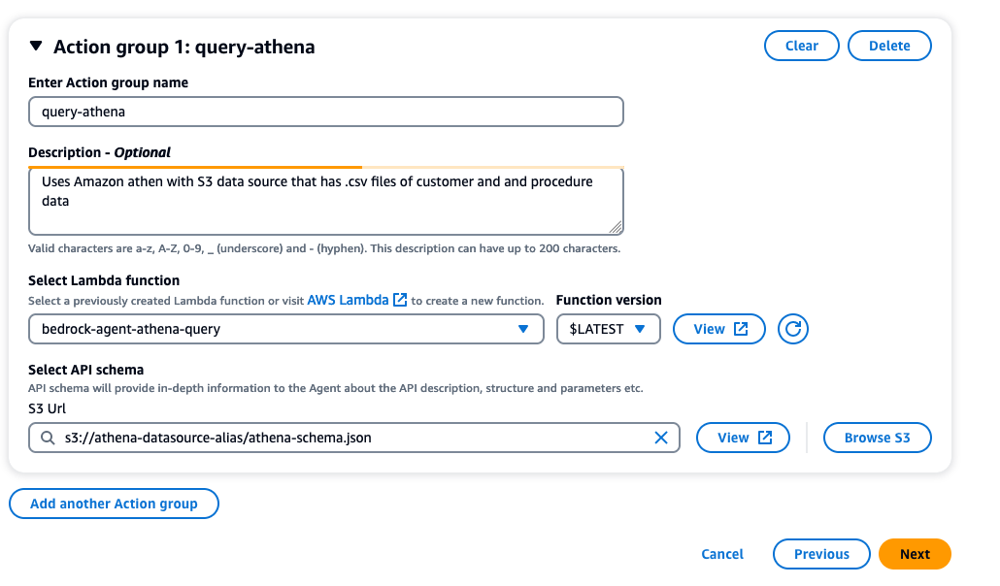

- Select **Next**, then **Next** again, as we are not associating a knowledge base. Then create the Agent

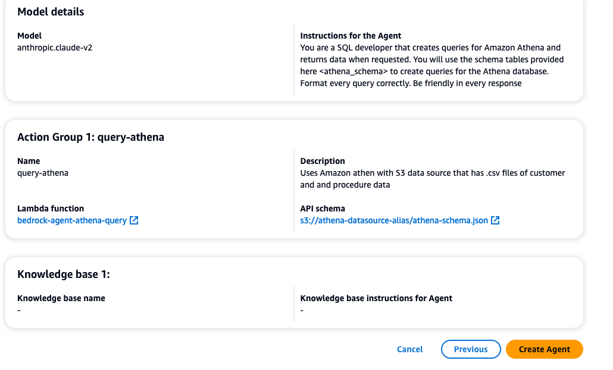


- Now, we need to provide the Bedrock agent the table schemas for Amazon Athena in order to build the queries. On the Agent Overview screen, scroll down and select **Working draft**


- Go down to **Advanced prompts** and select **Edit**


- Select the **Orchestration** tab. Toggle on the radio button **Override orchestration template defaults**. Make sure **Activate orchestration template** is enabled as well.

- In the **Prompt template editor**, scroll down to line seven right below the closing tag `</auxiliary_instructions>`. Make two line spaces, then copy/paste in the following table schemas and query examples within the prompt:

```sql
Here are the table schemas for the Amazon Athena database <athena_schemas>. 

<athena_schemas>
  <athena_schema>
  CREATE EXTERNAL TABLE athena_db.customers (
    `Cust_Id` integer,
    `Customer` string,
    `Balance` integer,
    `Past_Due` integer,
    `Vip` string
  )
  ROW FORMAT DELIMITED 
  FIELDS TERMINATED BY ',' 
  LINES TERMINATED BY '\n'
  STORED AS TEXTFILE
  LOCATION 's3://athena-datasource-{alias}/';  
  </athena_schema>
  
  <athena_schema>
  CREATE EXTERNAL TABLE athena_db.procedures (
    `Procedure_ID` string,
    `Procedure` string,
    `Category` string,
    `Price` integer,
    `Duration` integer,
    `Insurance_Covered` string,
    `Customer_Id` integer
  )
  ROW FORMAT DELIMITED 
  FIELDS TERMINATED BY ',' 
  LINES TERMINATED BY '\n'
  STORED AS TEXTFILE
  LOCATION 's3://athena-datasource-{alias}/';  
  </athena_schema>
</athena_schemas>

Here are examples of Amazon Athena queries <athena_examples>. Double check every query for correct format. You can also provide Amazon Athena queries if requested.

<athena_examples>
  <athena_example>
  SELECT * FROM athena_db.procedures WHERE insurance_covered = 'yes' OR insurance_covered = 'no';  
  </athena_example>
  
  <athena_example>
    SELECT * FROM athena_db.customers WHERE balance >= 0;
  </athena_example>
</athena_examples>

```


It should look similar to the following:


-Verify that the **alias** has been updated for both table schemas. Then, scroll to the bottom and select **Save and exit**


### Step 6: Create an alias
- Create an alias (new version), and choose a name of your liking. Make sure to copy and save your **AliasID**. You will need these in step 9.
 


- Next, navigate to the **Agent Overview** settings for the agent created by selecting **Agents** under the Orchestration dropdown menu on the left of the screen, then select the agent. Copy the Agent ARN, then add this ARN to the resource policy for Lambda function `bedrock-agent-txtsql-action` that was previously created in step 3. (Make sure to also save the **AgentID** at this step. It will be needed in step 9.)


## Step 7: Testing the Setup

### Testing the Bedrock Agent
- While in the Bedrock console, select **Agents** under the Orchestration tab, then the agent you created. You should be able to enter prompts in the user interface provided to test your action groups from the agent.

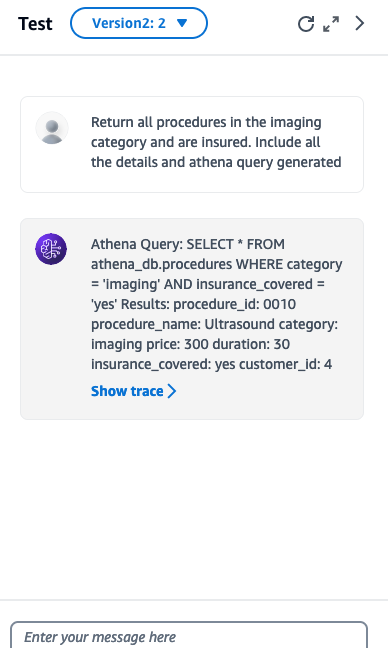


- Example prompts for Action Groups:

    1. Fetch me data by creating a query to return all procedures in the imaging category and are insured. Include all the details, along with the athena query created

    2. Fetch me data by creating an athena query that provides me details on all customser who are vip, and have a balance over 300.


## Step 8: Setting Up Cloud9 Environment (IDE)

1.	Navigate in the Cloud9 management console. Then, select **Create Environment**


2. Here, you will enter the following values in each field
   - **Name:** Bedrock-Environment (Enter any name)
   - **Instance type:** t3.small
   - **Platform:** Ubuntu Server 22.04 LTS
   - **Timeout:** 1 hour  


   - Once complete, select the **Create** button at the bottom of the screen. The environment will take a couple of minutes to spin up. If you get an error spinning up Cloud9 due to lack of resources, you can also choose t2.micro for the instance type and try again. (The Cloud9 environment has Python 3.10.12 version at the time of this publication)


3. Navigate back to the Cloud9 Environment, then select **open** next to the Cloud9 you just created. Now, you are ready to setup the Streamlit app!


## Step 9: Setting Up and Running the Streamlit App
1. **Obtain the Streamlit App ZIP File**: Download the zip file of the project [here](https://github.com/build-on-aws/bedrock-agent-txt2sql/archive/refs/heads/main.zip).

2. **Upload to Cloud9**:
   - In your Cloud9 environment, upload the ZIP file.


3. **Unzip the File**:
   - Use the command `unzip bedrock-agent-txt2sql-main.zip` to extract the contents.
4. **Navigate to Streamlit_App Folder**:
   - Change to the directory containing the Streamlit app. Use the command `cd ~/environment/bedrock-agent-txt2sql-main/Streamlit_App`
5. **Update Configuration**:
   - Open the `InvokeAgent.py` file.
   - Update the `agentId` and `agentAliasId` variables with the appropriate values, then save it.


6. **Install Streamlit** (if not already installed):
   - Run `pip install streamlit`. Additionally, make sure boto3, and pandas dependencies are installed by running `pip install boto3` and `pip install pandas`.

7. **Run the Streamlit App**:
   - Execute the command `streamlit run app.py --server.address=0.0.0.0 --server.port=8080`.
   - Streamlit will start the app, and you can view it by selecting "Preview" within the Cloud9 IDE at the top, then **Preview Running Application**
   - 
  

   - Once the app is running, please test some of the sample prompts provided. (On 1st try, if you receive an error, try again.)

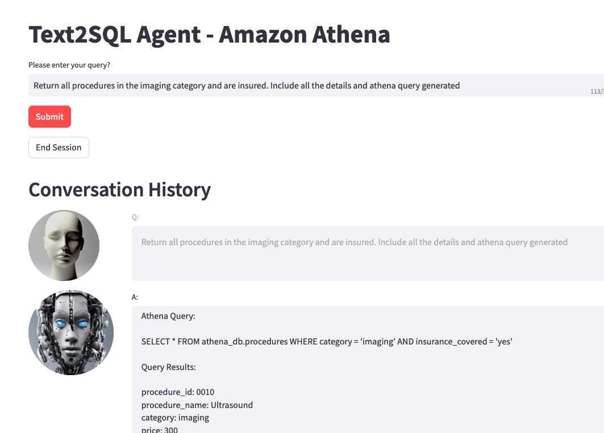

Optionally, you can review the trace events in the left toggle of the screen. This data will include the rational tracing, invocation input tracing, and observation tracing.


## Cleanup

After completing the setup and testing of the Bedrock Agent and Streamlit app, follow these steps to clean up your AWS environment and avoid unnecessary charges:
1. Delete S3 Buckets:
- Navigate to the S3 console.
- Select the buckets "athena-datasource-alias" and "bedrock-agents-athena-output-alias". Make sure that both of these buckets are empty by deleting the files. 
- Choose 'Delete' and confirm by entering the bucket name.

2.	Remove Lambda Function:
- Go to the Lambda console.
- Select the "bedrock-agent-txtsql-action" function.
- Click 'Delete' and confirm the action.

3.	Delete Bedrock Agent:
- In the Bedrock console, navigate to 'Agents'.
- Select the created agent, then choose 'Delete'.

4.	Clean Up Cloud9 Environment:
- Navigate to the Cloud9 management console.
- Select the Cloud9 environment you created, then delete.


## Security

See [CONTRIBUTING](CONTRIBUTING.md#security-issue-notifications) for more information.

## License

This library is licensed under the MIT-0 License. See the LICENSE file.

