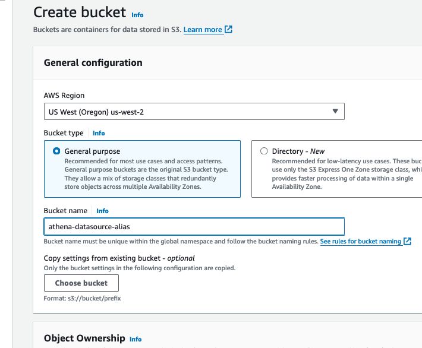

# Setup Amazon Bedrock Agent for Text2SQL with Streamlit


# Setup Agent with Amazon Bedrock and Streamlit

## Introduction
This guide details the setup process for an Amazon Bedrock agent on AWS, which will include setting up S3 buckets, a knowledge base, an action group, and a Lambda function. We will use the Streamlit framework for the user interface. The agent is designed for dynamically creating an investment company portfolio based on specific parameters, and providing a Q&A capability to FOMC reports. This exercise will include a sending email method, but will not be fully configured.

## Prerequisites
- An active AWS Account.
- Familiarity with AWS services like Amazon Bedrock, Amazon S3, AWS Lambda, Amazon Athena, and Amazon Cloud9.
- Grant access to all Amazon models if not already be default, and Anthropic Claude models from the Amazon Bedrock console.


## Diagram


## Configuration and Setup

### Step 1: Grant Model Access

- We will need to grant access to the models that will be needed for our agent in Bedrock. Navigate to the Amazon Bedrock console, then on the left of the screen, scroll down and select “Model access”. On the right, select the orange “manage model access” button.


- Select the checkbox next to "Anthropic", and "Amazon" if not by default already. After, scroll down to the bottom right and select “Request model access”. 


- After, verify that the Access status of the Models is green stating “Access granted”.


### Step 2: Creating S3 Buckets
- Please make sure that you are in the **us-west-2** region. If another region is required, you will need to update the region in the `InvokeAgent.py` file on line 22 of the code. 
- **Domain Data Bucket**: Create an S3 bucket to store the domain data. For example, call the S3 bucket "athena-datasource-alias". We will use the default settings. 




- After creation, upload the .csv files located [here](https://github.com/build-on-aws/bedrock-agent-txt2sql/tree/main/s3data) to the s3 bucket.
These 2 files contain mock data of customer and procedure information. We will use these files as the datasource for our Amazon Athena service to query from. Once the documents are uploaded, please review them.


- **Athena Bucket**: Create another S3 bucket for the Athena service. Call it "athena-destination-store-alias". You will need to use this S3 bucket when configuring the Amazon Athena service ina  later step.


 

### Step 3: Setup  Amazon Athena

- Search for the Athena service, then navigate to the Athena UI. Validate that the "Query your data with Trino SQL" radiobutton is selected, then press "Launch query editor".


- Next, we will need to create an Athena database. While on the Editor tab, copy/paste the following query 

in the empty query screen. After, select Run:

`CREATE DATABASE IF NOT EXISTS athena_db;`


- You should now see query successfull at the bottom. If so, change the default that is select for your database to "athena_db" as shown in the screenshot above.

- Lets create the customers table. Run the following query in Athena:

```sql
CREATE EXTERNAL TABLE IF NOT EXISTS athena_db.customers (
  `Cust_Id` integer,
  `Customer_Name` string,
  `Balance` integer,
  `Past_Due` integer,
  `Vip` string
)
ROW FORMAT DELIMITED 
FIELDS TERMINATED BY ',' 
LINES TERMINATED BY '\n'
STORED AS TEXTFILE
LOCATION 's3://genai-sourcedata-jo4/';
```


Open another query tab and create the procedures table by running this next query:

```sql
CREATE EXTERNAL TABLE IF NOT EXISTS athena_db.procedures (
  `Procedure_ID` string,
  `Procedure_Name` string,
  `Category` string,
  `Price` integer,
  `Duration` integer,
  `Insurance_Covered` string,
  `Customer_Id` integer
)
ROW FORMAT DELIMITED 
FIELDS TERMINATED BY ',' 
LINES TERMINATED BY '\n'
STORED AS TEXTFILE
LOCATION 's3://genai-sourcedata-jo4/';
```

Your tables for Athena within editor should look similar to the following:


- Now, lets quickly test to queries against the customers and procedures table by running the following two example queries below:

`SELECT *
FROM athena_db.procedures
WHERE insurance_covered = 'yes' OR insurance_covered = 'no';`


`SELECT * 
FROM athena_db.customers
WHERE balance >= 0;`


- If tests were succesful, we can move to the next step.

### Step 3: Lambda Function Configuration
- Create a Lambda function (Python 3.12) for the Bedrock agent's action group. We will call this Lambda function "bedrock-agent-txtsql-action". 


- Copy the provided code from the ["ActionLambda.py"](https://github.com/build-on-aws/bedrock-agents-streamlit/blob/main/ActionLambda.py) file into your Lambda function. After, select the deploy button in the tab section in the Lambda console. Review the code provided before moving to the next step. (Make sure that the IAM role associated with the Bedrock agent can invoke the Lambda function)


- Next, apply a resource policy to the Lambda to grant Bedrock agent access. To do this, we will switch the top tab from “code” to “configuration” and the side tab to “Permissions”. Then, scroll to the “Resource-based policy statements” section and click the “Add permissions” button.


- Here is an example of the resource policy. (At this part of the setup, we will not have a Bedrock agent Source ARN. So, enter in "arn:aws:bedrock:us-west-2:{accoundID}:agent/BedrockAgentID" for now. We will include the ARN once it’s generated in step 6 after creating the Bedrock Agent alias):


### Step 4: Setup Bedrock Agent and Action Group 
- Navigate to the Bedrock console, go to the toggle on the left, and under “Orchestration” select Agents, then select “Create Agent”.


- On the next screen, provide an agent name, like “SQL-Agent”. Leave the other options as default, then select “Next”


- Select the Anthropic: Claude V2 model. Now, we need to add instructions by creating a prompt that defines the rules of operation for the agent. In the prompt below, we provide specific direction on how the model should answer questions. Copy, then paste the details below into the agent instructions. 

"You are a SQL developer that creates queries for Amazon Athena and returns data when requested. You will use the schema tables provided here <athena_schema> to create queries for the Athena database. Format every query correctly. Be friendly in every response."


- When creating the agent, select Lambda function "bedrock-agent-txtsql-action". Next, select the schema file athena-schema.json from the s3 bucket "athena-datasource-alias". Then, select "Next" 


### Step 6: Create an alias
-Create an alias (new version), and choose a name of your liking. Make sure to copy and save your Agent ID and Agent Alias ID. You will need these in step 8.
 


- Next, navigate to the "Agent Overview" settings for the agent created by selecting "Agents" under the Orchestration dropdown menu on the left of the screen, then select the agent. Copy the Agent ARN, then add this ARN to the resource policy of Lambda function “bedrock-agent-txtsql-action” previously created in step 3. 


## Step 7: Testing the Setup

### Testing the Bedrock Agent
- While in the Bedrock console, select “Agents” under the Orchestration tab, then the agent you created. You should be able to enter prompts in the user interface provided to test your knowledge base and action groups from the agent.


- Example prompts for Action Groups:
    1. Return all procedures in the imaging category and are insured. Including the details

    2. Fetch me how many procedures are in the laboratory category, along with the Athena query created

    3. Return me the number of procedures that are either in the laboratory, imaging or surgery category, and that are insured

    4. Return me information on all customers who have a past due balance of over 70 dollars

    5. Get me all of the customers who are vip, and have a blance under 500 dollars

    6. Fetch me data of all procedures that were not insured, with customer names, and provide the athena query created

## Step 8: Setting Up Cloud9 Environment (IDE)

1.	Navigate in the Cloud9 management console. Then, select “Create Environment”


2. Here, you will enter the following values in each field
   - Name: Bedrock-Environment (Enter any name)
   - Instance type: t3.small
   - Platform: Ubuntu Server 22.04 LTS
   - Timeout: 1 hour  


   - Once complete, select the "Create" button at the bottom of the screen. The environment will take a couple of minutes to spin up. If you get an error spinning up Cloud9 due to lack of resources, you can also choose t2.micro for the instance type and try again. (The Cloud9 environment has Python 3.10.12 version at the time of this publication)


3. Navigate back to the Cloud9 Environment, then select "open" next to the Cloud9 you just created. Now, you are ready to setup the Streamlit app!


## Step 9: Setting Up and Running the Streamlit App
1. **Obtain the Streamlit App ZIP File**: Download the zip file of the project [here](https://github.com/build-on-aws/bedrock-agent-txt2sql/archive/refs/heads/main.zipp).

2. **Upload to Cloud9**:
   - In your Cloud9 environment, upload the ZIP file.


3. **Unzip the File**:
   - Use the command `unzip bedrock-agents-txt2sql-main.zip` to extract the contents.
4. **Navigate to Streamlit_App Folder**:
   - Change to the directory containing the Streamlit app. Use the command `cd ~/environment/bedrock-agents-txt2sql-main/Streamlit_App`
5. **Update Configuration**:
   - Open the `InvokeAgent.py` file.
   - Update the `agentId` and `agentAliasId` variables with the appropriate values, then save it.


6. **Install Streamlit** (if not already installed):
   - Run `pip install streamlit`. Additionally, make sure boto3, and pandas dependencies are installed by running `pip install boto3` and `pip install pandas`.

7. **Run the Streamlit App**:
   - Execute the command `streamlit run app.py --server.address=0.0.0.0 --server.port=8080`.
   - Streamlit will start the app, and you can view it by selecting "Preview" within the Cloud9 IDE at the top, then "Preview Running Application"
   - Once the app is running, please test some of the sample prompts provided. (On 1st try, if you receive an error, try again.)


Optionally, you can review the trace events in the left toggle of the screen. This data will include the rational tracing, invocation input tracing, and observation tracing.


## Cleanup

After completing the setup and testing of the Bedrock Agent and Streamlit app, follow these steps to clean up your AWS environment and avoid unnecessary charges:
1. Delete S3 Buckets:
- Navigate to the S3 console.
- Select the buckets "knowledgebase-bedrock-agent-alias" and "artifacts-bedrock-agent-creator-alias". Make sure that both of these buckets are empty by deleting the files. 
- Choose 'Delete' and confirm by entering the bucket name.

2.	Remove Lambda Function:
- Go to the Lambda console.
- Select the "bedrock-agent-txtsql-action" function.
- Click 'Delete' and confirm the action.

3.	Delete Bedrock Agent:
- In the Bedrock console, navigate to 'Agents'.
- Select the created agent, then choose 'Delete'.

4.	Deregister Knowledge Base in Bedrock:
- Access the Bedrock console, then navigate to “Knowledge base” under the Orchestration tab.
- Select, then delete the created knowledge base.

5.	Clean Up Cloud9 Environment:
- Navigate to the Cloud9 management console.
- Select the Cloud9 environment you created, then delete.


## Security

See [CONTRIBUTING](CONTRIBUTING.md#security-issue-notifications) for more information.

## License

This library is licensed under the MIT-0 License. See the LICENSE file.

