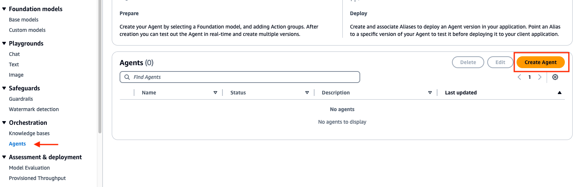
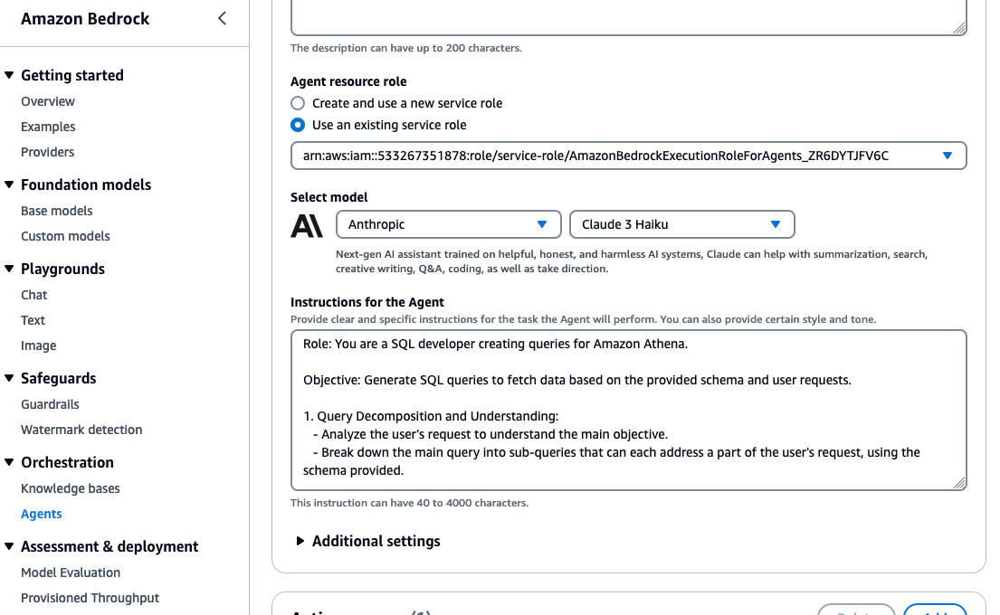

# Setup Amazon Bedrock Agent for Text2SQL Using Amazon Athena with Streamlit

## Introduction
We will setup an Amazon Bedrock agent with an action group that will be able to translate natural language to SQL queries. In this project, we will be querying an Amazon Athena database, but the concept can be applied to most SQL databases.

## Prerequisites
- An active AWS Account.
- Familiarity with AWS services like Amazon Bedrock, Amazon S3, AWS Lambda, Amazon Athena, and Amazon Cloud9.
- Access will need to be granted to the **Anthropic: Claude 3 Haiku** model from the Amazon Bedrock console.


## Diagram


## Configuration and Setup

### Step 1: Grant Model Access

- We will need to grant access to the models that will be needed for our Bedrock agent. Navigate to the Amazon Bedrock console, then on the left of the screen, scroll down and select **Model access**. On the right, select the orange **Manage model access** button.


- Select the checkbox for the base model column **Anthropic: Claude 3 Haiku**. This will provide you access to the required models. After, scroll down to the bottom right and select **Request model access**.


- After, verify that the Access status of the Models are green with **Access granted**.


### Step 2: Creating S3 Buckets
- Make sure that you are in the **us-west-2** region. If another region is required, you will need to update the region in the `InvokeAgent.py` file on line 24 of the code. 
- **Domain Data Bucket**: Create an S3 bucket to store the domain data. For example, call the S3 bucket `athena-datasource-{alias}`. We will use the default settings. 
(Make sure to update **{alias}** with the appropriate value throughout the README instructions.)


- Next, we will download .csv files that contain mock data for customers and procedures. Open up a terminal or command prompt, and run the following `curl` commands to download and save these files to the **Documents** folder:

For **Mac**
```linux
curl https://raw.githubusercontent.com/build-on-aws/bedrock-agent-txt2sql/main/s3data/mock-data-customers.csv --output ~/Documents/mock-data-customers.csv

curl https://raw.githubusercontent.com/build-on-aws/bedrock-agent-txt2sql/main/s3data/mock-data-procedures.csv --output ~/Documents/mock-data-procedures.csv
```

For **Windows**

```windows
curl https://raw.githubusercontent.com/build-on-aws/bedrock-agent-txt2sql/main/s3data/mock-data-customers.csv --output %USERPROFILE%\Documents\mock-data-customers.csv

curl https://raw.githubusercontent.com/build-on-aws/bedrock-agent-txt2sql/main/s3data/mock-data-procedures.csv --output %USERPROFILE%\Documents\mock-data-procedures.csv
```

- These files are the datasource for Amazon Athena. Upload these files to S3 bucket `athena-datasource-{alias}`. Once the documents are uploaded, please review them.


- **Amazon Athena Bucket**: Create another S3 bucket for the Athena service. Call it `athena-destination-store-{alias}`. You will need to use this S3 bucket when configuring Amazon Athena in the next step. 


### Step 3: Setup  Amazon Athena

- Search for the Amazon Athena service, then navigate to the Athena management console. Validate that the **Query your data with Trino SQL** radio button is selected, then press **Launch query editor**.


- Before you run your first query in Athena, you need to set up a query result location with Amazon S3. Select the **Settings** tab, then the **Manage** button in the **Query result location and ecryption** section. 


- Add the S3 prefix below for the query results location, then select the Save button:

```text
s3://athena-destination-store-{alias}
```


- Next, we will create an Athena database. Select the **Editor** tab, then copy/paste the following query in the empty query screen. After, select Run:

```sql
CREATE DATABASE IF NOT EXISTS athena_db;
```


- You should see query successful at the bottom. On the left side under **Database**, change the default database to `athena_db`, if not by default.

- We'll need to create the `customers` table. Run the following query in Athena. `(Remember to update the {alias} field)`:

```sql
CREATE EXTERNAL TABLE athena_db.customers (
  `Cust_Id` integer,
  `Customer` string,
  `Balance` integer,
  `Past_Due` integer,
  `Vip` string
)
ROW FORMAT DELIMITED 
FIELDS TERMINATED BY ',' 
LINES TERMINATED BY '\n'
STORED AS TEXTFILE
LOCATION 's3://athena-datasource-{alias}/';
```


- Open another query tab and create the `procedures` table by running this query. `(Remember to update the {alias} field)`:

```sql
CREATE EXTERNAL TABLE athena_db.procedures (
  `Procedure_Id` string,
  `Procedure` string,
  `Category` string,
  `Price` integer,
  `Duration` integer,
  `Insurance` string,
  `Customer_Id` integer
)
ROW FORMAT DELIMITED 
FIELDS TERMINATED BY ',' 
LINES TERMINATED BY '\n'
STORED AS TEXTFILE
LOCATION 's3://athena-datasource-{alias}/';
```


- Your tables for Athena within editor should look similar to the following:


- Now, lets quickly test the queries against the customers and procedures table by running the following two example queries below:

```sql
SELECT *
FROM athena_db.procedures
WHERE insurance = 'yes' OR insurance = 'no';
```


```sql
SELECT * 
FROM athena_db.customers
WHERE balance >= 0;
```


- If tests were succesful, we can move to the next step.


### Step 4: Lambda Function Configuration
- Create a Lambda function (Python 3.12) for the Bedrock agent's action group. We will call this Lambda function `bedrock-agent-txtsql-action`. 


- Copy the provided code from [here](https://github.com/build-on-aws/bedrock-agent-txt2sql/blob/main/function/lambda_function.py), or from below into the Lambda function.
  
```python
import boto3
from time import sleep

# Initialize the Athena client
athena_client = boto3.client('athena')

def lambda_handler(event, context):
    print(event)

    def athena_query_handler(event):
        # Fetch parameters for the new fields

        # Extracting the SQL query
        query = event['requestBody']['content']['application/json']['properties'][0]['value']

        print("the received QUERY:",  query)
        
        s3_output = 's3://athena-destination-store-alias'  # Replace with your S3 bucket

        # Execute the query and wait for completion
        execution_id = execute_athena_query(query, s3_output)
        result = get_query_results(execution_id)

        return result

    def execute_athena_query(query, s3_output):
        response = athena_client.start_query_execution(
            QueryString=query,
            ResultConfiguration={'OutputLocation': s3_output}
        )
        return response['QueryExecutionId']

    def check_query_status(execution_id):
        response = athena_client.get_query_execution(QueryExecutionId=execution_id)
        return response['QueryExecution']['Status']['State']

    def get_query_results(execution_id):
        while True:
            status = check_query_status(execution_id)
            if status in ['SUCCEEDED', 'FAILED', 'CANCELLED']:
                break
            sleep(1)  # Polling interval

        if status == 'SUCCEEDED':
            return athena_client.get_query_results(QueryExecutionId=execution_id)
        else:
            raise Exception(f"Query failed with status '{status}'")

    action_group = event.get('actionGroup')
    api_path = event.get('apiPath')

    print("api_path: ", api_path)

    result = ''
    response_code = 200


    if api_path == '/athenaQuery':
        result = athena_query_handler(event)
    else:
        response_code = 404
        result = {"error": f"Unrecognized api path: {action_group}::{api_path}"}

    response_body = {
        'application/json': {
            'body': result
        }
    }

    action_response = {
        'actionGroup': action_group,
        'apiPath': api_path,
        'httpMethod': event.get('httpMethod'),
        'httpStatusCode': response_code,
        'responseBody': response_body
    }

    api_response = {'messageVersion': '1.0', 'response': action_response}
    return api_response
```

- Then, update the **alias** value for the `s3_output` variable in the python code above. After, select **Deploy** under **Code source** in the Lambda console. Review the code provided before moving to the next step.


- Now, we need to apply a resource policy to Lambda that grants Bedrock agent access. To do this, we will switch the top tab from **code** to **configuration** and the side tab to **Permissions**. Then, scroll to the **Resource-based policy statements** section and click the **Add permissions** button.


- Enter `arn:aws:bedrock:us-west-2:{aws-account-id}:agent/* `. ***Please note, AWS recommends least privilage so only the allowed agent can invoke this Lambda function***. A `*` at the end of the ARN grants any agent in the account access to invoke this Lambda. Ideally, we would not use this in a production environment. Lastly, for the Action, select `lambda:InvokeAction`, then ***Save***.


- We also need to provide this Lambda function permissions to interact with an S3 bucket, and Amazon Athena service. While on the `Configuration` tab -> `Permissions` section, select the Role name:


- Select `Add permissions -> Attach policies`. Then, attach the AWS managed policies ***AmazonAthenaFullAccess***,  and ***AmazonS3FullAccess*** by selecting, then adding the permissions. Please note, in a real world environment, it's recommended that you practice least privilage.


- The last thing we need to do with the Lambda is update the configurations. Navigate to the `Configuration` tab, then `General Configuration` section on the left. From here select Edit.


- Update the memory to 1024 MB, and Timeout to 1 minute. Scroll to the bottom, and save the changes.


- We are now done setting up the Lambda function


### Step 5: Setup Bedrock agent and action group 
- Navigate to the Bedrock console. Go to the toggle on the left, and under **Orchestration** select ***Agents***, then ***Create Agent***. Provide an agent name, like `athena-agent` then ***Create***.



- The agent description is optional, and use the default new service role. For the model, select **Anthropic Claude 3 Haiku**. Next, provide the following instruction for the agent:


```instruction
Role: You are a SQL developer creating queries for Amazon Athena.

Objective: Generate SQL queries to return data based on the provided schema and user request. Also, returns SQL query created.

1. Query Decomposition and Understanding:
   - Analyze the user’s request to understand the main objective.
   - Break down reqeusts into sub-queries that can each address a part of the user's request, using the schema provided.

2. SQL Query Creation:
   - For each sub-query, use the relevant tables and fields from the provided schema.
   - Construct SQL queries that are precise and tailored to retrieve the exact data required by the user’s request.

3. Query Execution and Response:
   - Execute the constructed SQL queries against the Amazon Athena database.
   - Return the results exactly as they are fetched from the database, ensuring data integrity and accuracy. Also, return the SQL query generated.
   - Maintain a friendly and professional tone in all communications.
```

It should look similar to the following: 



- Scroll to the top, then select ***Save***.

- Keep in mind that these instructions guide the generative AI application in its role as a SQL developer creating efficient and accurate queries for Amazon Athena. The process involves understanding user requests, decomposing them into manageable sub-queries, and executing these to fetch precise data. This structured approach ensures that responses are not only accurate but also relevant to the user's needs, thereby enhancing user interaction and data retrieval efficiency.


- Next, we will add an action group. Scroll down to `Action groups` then select ***Add***.

- Call the action group `query-athena`. We will keep `Action group type` set to ***Define with API schemas***. `Action group invocations` should be set to ***select an existing Lambda function***. For the Lambda function, select `bedrock-agent-txtsql-action`.

- For the `Action group Schema`, we will choose ***Define with in-line OpenAPI schema editor***. Replace the default schema in the **In-line OpenAPI schema** editor with the schema provided below. You can also retrieve the schema from the repo [here](https://github.com/build-on-aws/bedrock-agent-txt2sql/blob/main/schema/athena-schema.json). After, select ***Add***.
`(This API schema is needed so that the bedrock agent knows the format structure and parameters needed for the action group to interact with the Lambda function.)`

```schema
{
  "openapi": "3.0.1",
  "info": {
    "title": "AthenaQuery API",
    "description": "API for querying data from an Athena database",
    "version": "1.0.0"
  },
  "paths": {
    "/athenaQuery": {
      "post": {
        "description": "Execute a query on an Athena database",
        "requestBody": {
          "description": "Athena query details",
          "required": true,
          "content": {
            "application/json": {
              "schema": {
                "type": "object",
                "properties": {
                  "Procedure ID": {
                    "type": "string",
                    "description": "Unique identifier for the procedure",
                    "nullable": true
                  },
                  "Query": {
                    "type": "string",
                    "description": "SQL Query"
                  }
                }
              }
            }
          }
        },
        "responses": {
          "200": {
            "description": "Successful response with query results",
            "content": {
              "application/json": {
                "schema": {
                  "type": "object",
                  "properties": {
                    "ResultSet": {
                      "type": "array",
                      "items": {
                        "type": "object",
                        "description": "A single row of query results"
                      },
                      "description": "Results returned by the query"
                    }
                  }
                }
              }
            }
          },
          "default": {
            "description": "Error response",
            "content": {
              "application/json": {
                "schema": {
                  "type": "object",
                  "properties": {
                    "message": {
                      "type": "string"
                    }
                  }
                }
              }
            }
          }
        }
      }
    }
  }
}
```

Your configuration should look like the following:


- Now we will need to modify the **Advanced prompts**. Select the orange **Edit in Agent Builder** button at the top. Scroll to the bottom and in the advanced prompts section, select `Edit`.


- In the `Advanced prompts`, navigate to the **Orchestration** tab. Enable the `Override orchestration template defaults` option. Also, make sure that `Activate orchestration template` is enabled. 

- In the `Prompt template editor`, go to line 22-23, then copy/paste the following prompt:

```sql
Here are the table schemas for the Amazon Athena database <athena_schemas>. 

<athena_schemas>
  <athena_schema>
  CREATE EXTERNAL TABLE athena_db.customers (
    `Cust_Id` integer,
    `Customer` string,
    `Balance` integer,
    `Past_Due` integer,
    `Vip` string
  )
  ROW FORMAT DELIMITED 
  FIELDS TERMINATED BY ',' 
  LINES TERMINATED BY '\n'
  STORED AS TEXTFILE
  LOCATION 's3://athena-datasource-{alias}/';  
  </athena_schema>
  
  <athena_schema>
  CREATE EXTERNAL TABLE athena_db.procedures (
    `Procedure_ID` string,
    `Procedure` string,
    `Category` string,
    `Price` integer,
    `Duration` integer,
    `Insurance` string,
    `Customer_Id` integer
  )
  ROW FORMAT DELIMITED 
  FIELDS TERMINATED BY ',' 
  LINES TERMINATED BY '\n'
  STORED AS TEXTFILE
  LOCATION 's3://athena-datasource-{alias}/';  
  </athena_schema>
</athena_schemas>

Here are examples of Amazon Athena queries <athena_examples>.

<athena_examples>
  <athena_example>
  SELECT * FROM athena_db.procedures WHERE insurance = 'yes' OR insurance = 'no';  
  </athena_example>
  
  <athena_example>
    SELECT * FROM athena_db.customers WHERE balance >= 0;
  </athena_example>
</athena_examples>
```


- This prompt helps provide the agent an example of the table schema(s) used for the database, along with an example of how the Amazon Athena query should be formatted. Additionally, there is an option to use a [custom parser Lambda function](https://docs.aws.amazon.com/bedrock/latest/userguide/lambda-parser.html) for more granular formatting. 

- Scroll to the bottom and select the ***Save and exit***. Then, ***Save and exit*** one more time.


### Step 6: Create an alias
- While query-agent is still selected, scroll down to the Alias secion and select ***Create***. Choose a name of your liking. Make sure to copy and save your **AliasID**. You will need this in step 9.
 


- Next, navigate to the **Agent Overview** settings for the agent created by selecting **Agents** under the Orchestration dropdown menu on the left of the screen, then select the agent. Save the **AgentID** because you will also need this in step 9.


## Step 7: Testing the Setup

### Testing the Bedrock Agent
- While on the Bedrock console, select **Agents** under the *Orchestration* tab, then the agent you created. Select ***Edit in Agent Builder***, and make sure to **Prepare** the agent so that the changes made can update. After, ***Save and exit***. On the right, you will be able to enter prompts in the user interface to test your Bedrock agent.`(You may be prompt to prepare the agent once more before testing the latest chages form the AWS console)` 


- Example prompts for Action Groups:

    1. Show me all of the procedures in the imaging category that are insured.

    2. Show me all of the customers that are vip, and have a balance over 200 dollars.
       


## Step 8: Setting Up Cloud9 Environment (IDE)

1.	Navigate in the Cloud9 management console. Then, select **Create Environment**


2. Here, you will enter the following values in each field
   - **Name:** Bedrock-Environment (Enter any name)
   - **Instance type:** t3.small
   - **Platform:** Ubuntu Server 22.04 LTS
   - **Timeout:** 1 hour  


   - Once complete, select the **Create** button at the bottom of the screen. The environment will take a couple of minutes to spin up. If you get an error spinning up Cloud9 due to lack of resources, you can also choose t2.micro for the instance type and try again. (The Cloud9 environment has Python 3.10.12 version at the time of this publication)


3. Navigate back to the Cloud9 Environment, then select **open** next to the Cloud9 you just created. Now, you are ready to setup the Streamlit app!


## Step 9: Setting Up and Running the Streamlit App
1. **Obtain the Streamlit App ZIP File**: Download the zip file of the project [here](https://github.com/build-on-aws/bedrock-agent-txt2sql/archive/refs/heads/main.zip).

2. **Upload to Cloud9**:
   - In your Cloud9 environment, upload the ZIP file.


3. **Unzip the File**:
   - Use the command `unzip bedrock-agent-txt2sql-main.zip` to extract the contents.
4. **Navigate to Streamlit_App Folder**:
   - Change to the directory containing the Streamlit app. Use the command `cd ~/environment/bedrock-agent-txt2sql-main/Streamlit_App`
5. **Update Configuration**:
   - Open the `InvokeAgent.py` file.
   - Update the `agentId` and `agentAliasId` variables with the appropriate values, then save it.


6. **Install Streamlit** (if not already installed):
   - Run the following command to install all of the dependencies needed:

     ```bash
     pip install streamlit boto3 pandas
     ```
     
7. **Run the Streamlit App**:
   - Execute the command `streamlit run app.py --server.address=0.0.0.0 --server.port=8080`.
   - Streamlit will start the app, and you can view it by selecting "Preview" within the Cloud9 IDE at the top, then **Preview Running Application**
   - 
  

   - Once the app is running, please test some of the sample prompts provided. (On 1st try, if you receive an error, try again.)


Optionally, you can review the trace events in the left toggle of the screen. This data will include the rational tracing, invocation input tracing, and observation tracing.


## Cleanup

After completing the setup and testing of the Bedrock Agent and Streamlit app, follow these steps to clean up your AWS environment and avoid unnecessary charges:
1. Delete S3 Buckets:
- Navigate to the S3 console.
- Select the buckets "athena-datasource-alias" and "bedrock-agents-athena-output-alias". Make sure that both of these buckets are empty by deleting the files. 
- Choose 'Delete' and confirm by entering the bucket name.

2.	Remove Lambda Function:
- Go to the Lambda console.
- Select the "bedrock-agent-txtsql-action" function.
- Click 'Delete' and confirm the action.

3.	Delete Bedrock Agent:
- In the Bedrock console, navigate to 'Agents'.
- Select the created agent, then choose 'Delete'.

4.	Clean Up Cloud9 Environment:
- Navigate to the Cloud9 management console.
- Select the Cloud9 environment you created, then delete.


## Security

See [CONTRIBUTING](CONTRIBUTING.md#security-issue-notifications) for more information.

## License

This library is licensed under the MIT-0 License. See the LICENSE file.

